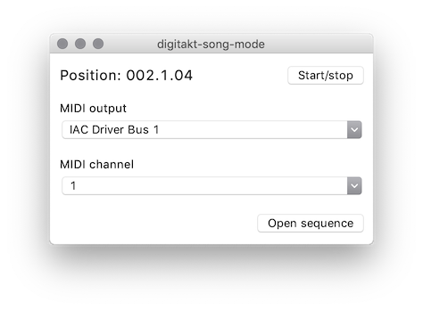

# digitakt-song-mode

digitakt-song-mode is a prototype of a desktop app that provides so-called "song mode" for [Elektron](https://www.elektron.se/) Digitakt sampler. The app should also work for the Digitone synthesizer - it wasn't tested though.

Built with [diquencer](https://github.com/mcjlnrtwcz/diquencer) library for MIDI sequencing.



## Installation

Use the [pipenv](https://pipenv.readthedocs.io/en/latest/) environment manager (via `Makefile`) to install digitakt-song-mode.
```bash
make install
```

## Usage

To launch enter the shell and execute Python script.
```bash
make start
```

The songs are stored in JSON files (no editor available yet). See [example](extras/example.json) for reference.
The `mutes` list determines which tracks should be silent. If all tracks should play leave the list empty.

## Development

For development purposes you need to install development packages.
```bash
make install_dev
```

The `Makefile` provides the following convenience targets:
- `shell`: enter the shell,
- `format`: auto-format code with `black`,
- `sort`: sort imports with `isort`,
- `lint`: check compliance with `flake8`.

## Contributing
Pull requests are welcome. For major changes, please open an issue first to discuss what you would like to change.

Please make sure to update tests (if there are any) as appropriate.

## License
[MIT](LICENSE)
